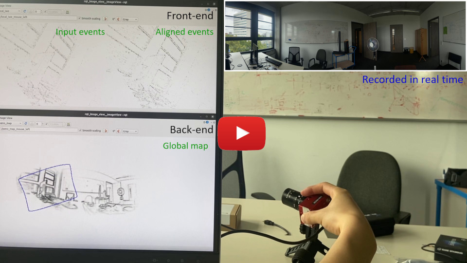

# CMax-SLAM

Official repository for [**CMax-SLAM: Event-based Rotational-Motion Bundle Adjustment and SLAM System using Contrast Maximization**](https://arxiv.org/pdf/2403.08119), **IEEE T-RO 2024**, by [Shuang Guo](https://www.linkedin.com/in/shuang-guo-00b664266) and [Guillermo Gallego](https://sites.google.com/view/guillermogallego).
<h2 align="left">

[Paper](https://doi.org/10.1109/TRO.2024.3378443) | [PDF](https://arxiv.org/pdf/2403.08119) | [Video](https://youtu.be/17VWTuSkgPs) | [Dataset](https://github.com/tub-rip/ECRot)
</h2>

[](https://youtu.be/17VWTuSkgPs)


## Citation

If you use this work in your research, please consider citing:

```bibtex
@Article{Guo24tro,
  author        = {Shuang Guo and Guillermo Gallego},
  title         = {{CMax}-{SLAM}: Event-based Rotational-Motion Bundle Adjustment
                  and {SLAM} System using Contrast Maximization},
  journal       = {{IEEE} Transactions on Robotics},
  year          = 2024,
  volume        = {40},
  number        = {},
  pages         = {2442--2461},
  doi           = {10.1109/TRO.2024.3378443}
}

@InProceedings{Gallego18cvpr,
  author        = {Guillermo Gallego and Henri Rebecq and Davide Scaramuzza},
  title         = {A Unifying Contrast Maximization Framework for Event Cameras,
                  with Applications to Motion, Depth, and Optical Flow
                  Estimation},
  booktitle     = {{IEEE} Conf. Comput. Vis. Pattern Recog. (CVPR)},
  year          = 2018,
  pages         = {3867--3876},
  doi           = {10.1109/CVPR.2018.00407}
}
```

-------
## Setup

### High-level Input-Output


**Input**:
- Events.
- Camera calibration.

**Output**:
- Rotational motion of the event camera.
- Local (front-end) and global (back-end) image of warped events (IWEs).

## Usage
- [Installation](docs/installation.md)
- [Test on Datasets](docs/test_datasets.md)
- [Live demo with a DAVIS camera](docs/live_demo.md)
- [Parameter Guide](docs/patermeters.md)

## [Event Camera Rotation Dataset (ECRot)](https://github.com/tub-rip/ECRot)

We also release the dataset that we made, see and download it from [here](https://github.com/tub-rip/ECRot). 
The instructions of running CMax-SLAM on the ECRot datasets can be found [here](https://github.com/tub-rip/cmax_slam/blob/main/docs/test_datasets.md).

## Acknowledgements

This code leverages the following repository for computing the derivative of Lie Group B-splines:
- [Basalt Headers](https://gitlab.com/VladyslavUsenko/basalt-headers)

## Additional Resources

* [Research page (TU Berlin RIP lab)](https://sites.google.com/view/guillermogallego/research/event-based-vision)
* [Course at TU Berlin](https://sites.google.com/view/guillermogallego/teaching/event-based-robot-vision)
* [Survey paper](http://rpg.ifi.uzh.ch/docs/EventVisionSurvey.pdf)
* [List of Resources](https://github.com/uzh-rpg/event-based_vision_resources)
